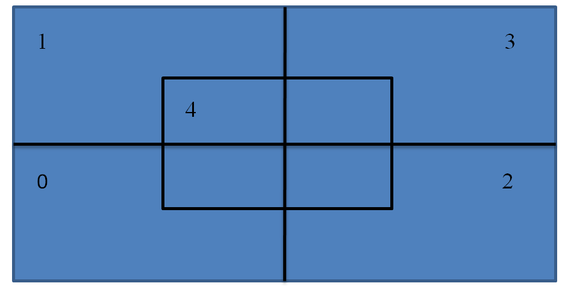

# Projekt WdSI

## Opis projektu
Projekt polega na wykorzystaniu uczenia maszynowego do wykrycia na zdjęciach znaków ograniczenia prędkości oraz ich pozycji na zdjęciu (dzieli na 2 typy speedlimit oraz other)
## Wymagane umiejscowienie plików

```
├── test
   ├── annotations
   └── images
├── train
   ├── annotations
   └── images
└── To_repozytorium (dowolna nazwa)
   └── main.py
```
## Przykładowy plik .xml w folderze "annotations"
```
<annotation>
   <folder>images</folder>
   <filename>road214.png</filename>
   <size>
       <width>300</width>
       <height>400</height>
       <depth>3</depth>
   </size>
   <segmented>0</segmented>
   <object>
       <name>speedlimit</name>
       <pose>Unspecified</pose>
       <truncated>0</truncated>
       <occluded>0</occluded>
       <difficult>0</difficult>
       <bndbox>
           <xmin>127</xmin>
           <ymin>166</ymin>
           <xmax>145</xmax>
           <ymax>185</ymax>
       </bndbox>
   </object>
</annotation>
```
## Wyjaśnienie poleceń
Po nauce klasyfikatora możliwe jest użycie następujących poleceń:
* classify - sprawdzanie pojedynczych zbiorów zdjęć aby sprawdzić klase 
* detect - sprawdzenie całego folderu zdjęć train/images wypisanie znajdujących się elementów oraz ich położenia 
## Uwaga!!!
Należy mieć zainstalowaną biblioteke cv2.
# Jak wykrywane jest położenie znaków?

Podczas wykrywania znaków obraz jest podzielany na prostokąty jak w przykładzie wyżej, a prostokąty oznaczone numerami {0,1,2,3} są dzielone znowu tak samo rekurencyjnie aż do osiągnięcia ustawionej maksymalny poziomu rekurencji (domyślnie 3).
Czyli obraz dzielony jest na (1(nie podzielony)+5+20+80) 106 kwadratów dla których obliczana jest predykcja. Jeżeli po predykcji okaże się że mały prostokąt znajduje się w większym prostokącie to ten większy jest usuwany. Następnie kolejne prostokąty z predykcją >=0.5 są powiększane/zmniejszane w taki sposób aby uzyskać jak największą predykcje. W następnej części usuwane są prostokąty o podobnych granicach (jeżeli granice są podobne w zakresie +/- 50 pikseli )

